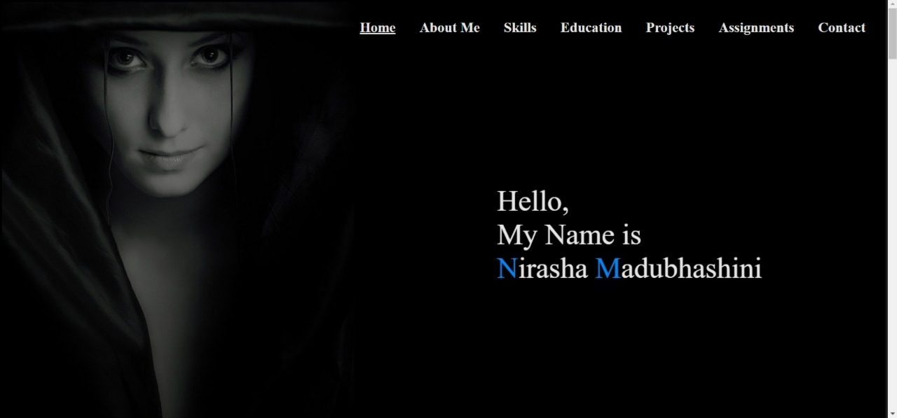
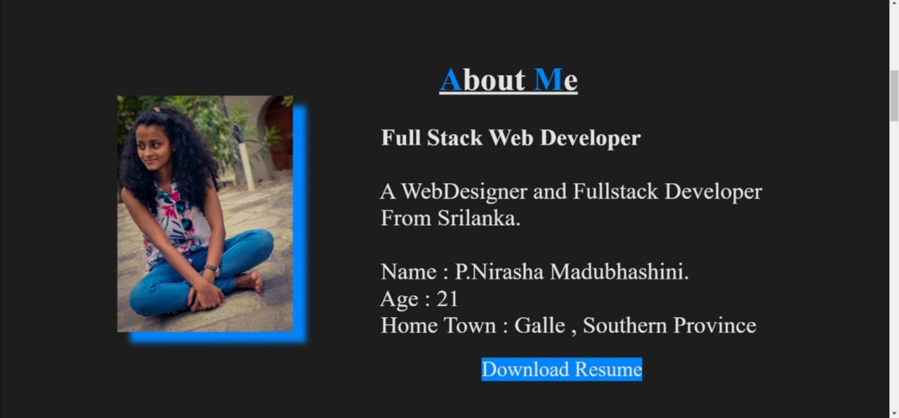
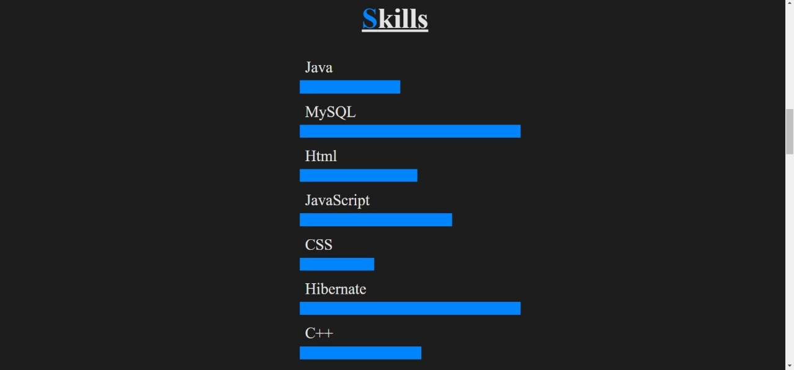
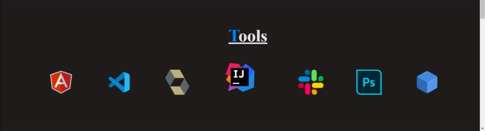
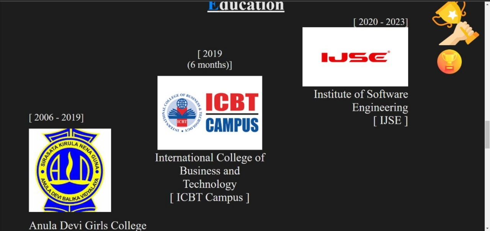
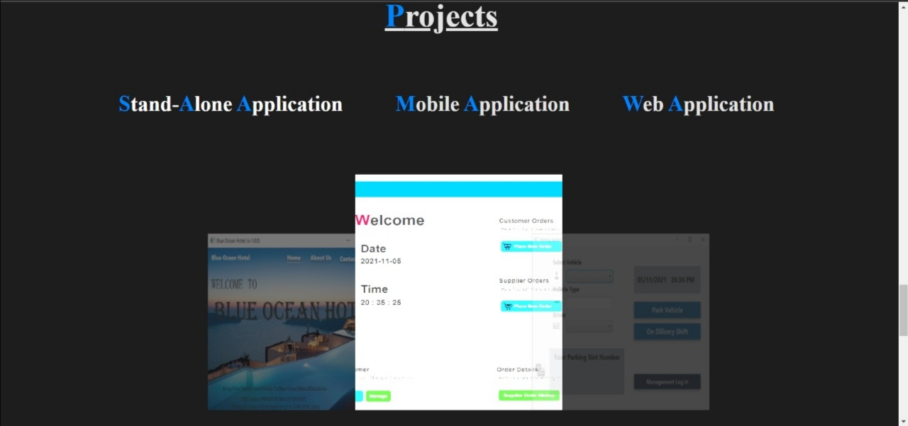
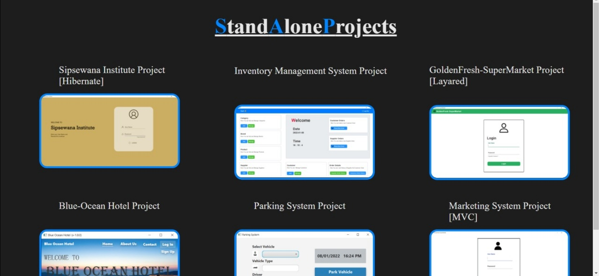
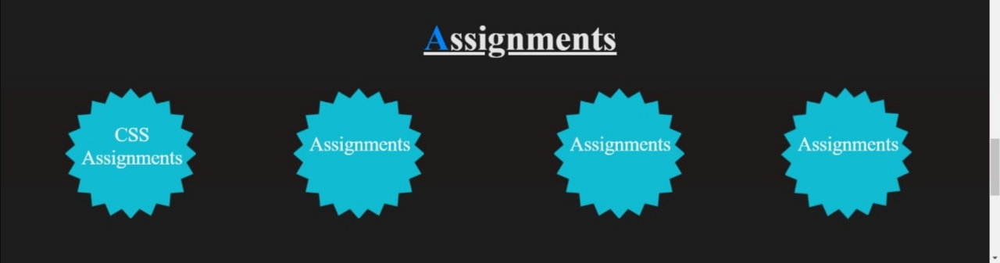
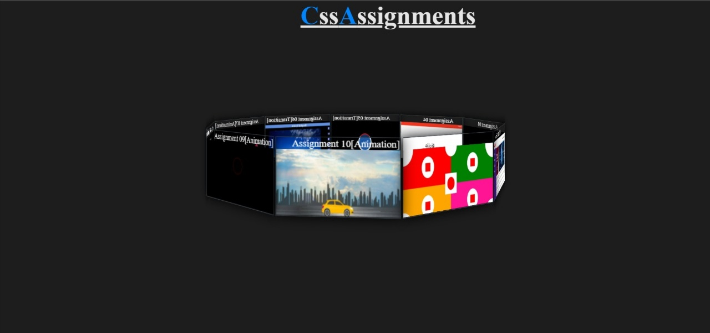
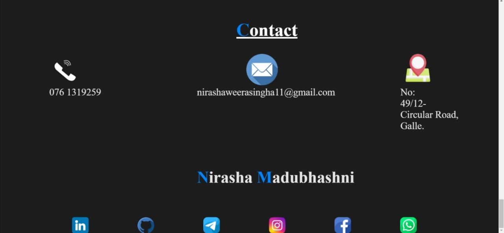

This is my very first project made by using CSS and HTML. 
I am able to add projects and assignments done by me for this project. 
There are some links that I use to make this project.

Site map = https://www.gloomaps.com/PN2RMrifKk

Wire frame = https://wireframe.cc/u7da7I

Mock up= https://www.figma.com/file/OlrvgmR1CiX6Fwo5AIHT1V/Untitled?node-id=0%3A1

ooowebhost = https://nirashamadubhashini.000webhostapp.com/

github = https://github.com/NirashaMadubhashini

githubPages = https://nirashamadubhashini.github.io/MyProfile/

##Screenshots of my website##

01.Home page

02.AboutMe Page

03.Skills Page

04.Tools

05.Education Page

06.Project Page

07.StandAloneProjects Page

08.Assignments Page

09.CSSAssignment Page

10.Contact Page

